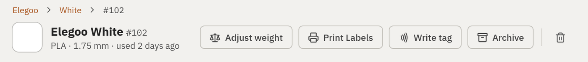
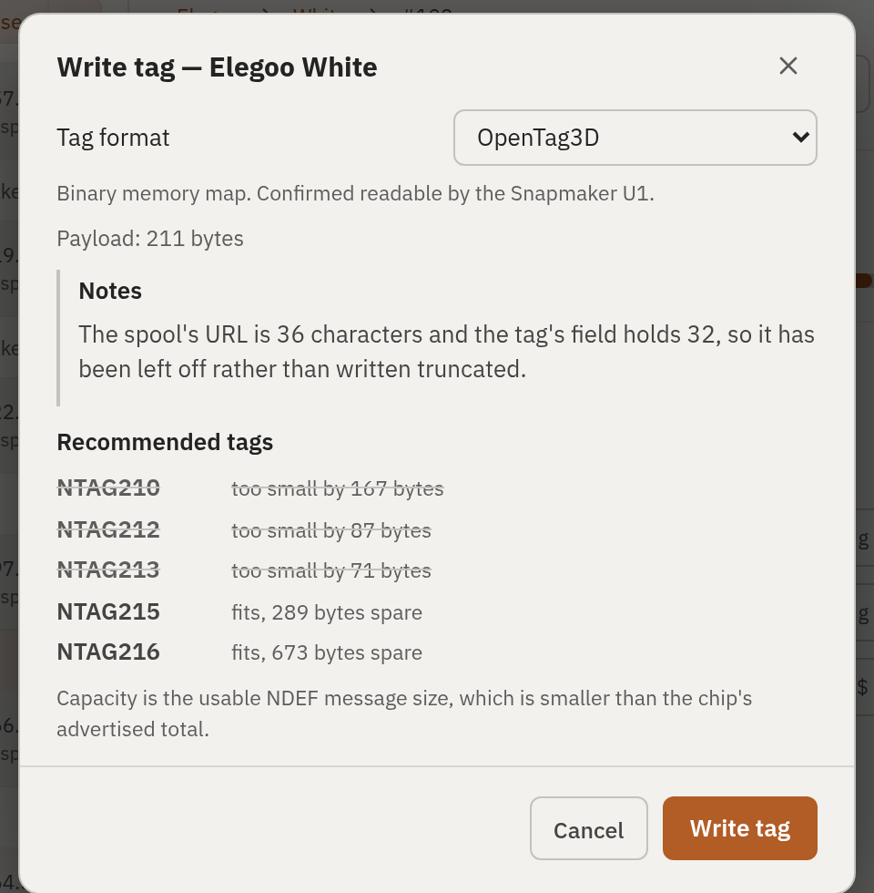
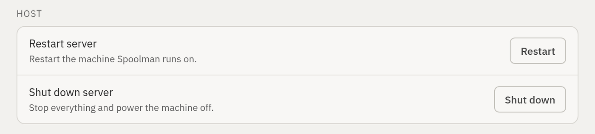
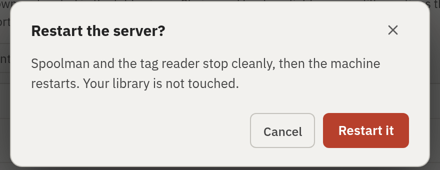

# Spoolman NFC Companion

**Stick an NFC sticker on a spool of filament, tap it on a reader, and your
computer knows which spool it is.**

That is the whole idea. If you print a lot, you end up with a shelf of
part-used spools and no reliable way to tell the software which one you just
loaded. [Spoolman](https://github.com/Donkie/Spoolman) keeps the inventory —
what each spool is, how much is left, what it cost. This adds the missing
physical link: a cheap NFC sticker on each spool, a reader on the desk, and a
tap that identifies it.

It also watches a Snapmaker U1 and records which spool is in which of its four
channels, so the inventory reflects what is physically loaded without anyone
typing it in.

**Spoolman itself is not modified.** Its Python is completely untouched. This is
a patch to **5 files in Spoolman's web interface** (plus this README), alongside
new files that stand on their own and talk to Spoolman only through its public
API. That is deliberate: when Spoolman releases a new version, there are five
small conflicts to resolve instead of a fork that has drifted for a year.

---

## What you get

| | |
|---|---|
| **Write a tag** | A button on each spool. Shows what will be written, which tag chips have room for it, and reads the tag back afterwards to confirm it took. |
| **Tap a tag** | A dialog appears saying what it is — `Elegoo / PLA / Basic / White (#102)` — and offers to open that spool, rewrite the tag, or erase it. |
| **Archive a spool** | Offers to free its tag so the sticker can be reused on another roll. The tag is not erased, just unlinked. |
| **Add a spool** | The add dialog ends by offering to tag it. Add four spools at once and it walks them one at a time. |
| **Restart / shut down** | The machine Spoolman runs on, from its Settings page. Useful when the server is in a cupboard. |
| **Snapmaker U1 sync** | Mirrors each channel's loaded spool into Spoolman's Location field, and binds a channel to the right spool when the printer's own tag lookup stalls. |

Four tag formats are supported: **OpenTag3D** (the default), **OpenSpool**,
**nfc2klipper**, and **UID-only** (which writes nothing to the tag and just
records its serial number).

### Writing a tag

A **Write tag** button joins the spool's own action row, beside Print Labels —
not tucked away on a separate page.



The dialog says what it is about to write and how big it is, and — because a
211-byte payload does not fit every sticker — which chips have room for it
before you waste one. After writing, it reads the tag back and verifies it.



The note in that dialog is a real one: the spool's URL did not fit the tag's
32-byte field, so it was left off rather than written truncated. Anything the
format has to give up is reported rather than done quietly.

### Restarting the server

Spoolman has no way to restart its own machine, which is least convenient
exactly when you need it — the server is misbehaving, or an SD card is about to
come out and should be stopped cleanly first. A **Host** section at the bottom
of Settings adds it.



Both ask first, and both say what will actually happen.



The section hides itself entirely unless the host reports that it will accept
the request, so an install without the sudoers rule from step 6 shows no
buttons rather than buttons that fail.

## Hardware

| | |
|---|---|
| **Reader** | PN532 NFC module on a USB serial adapter. Verified with a **CH340** bridge (`1a86:7523`), the common cheap variety. It must present as a serial device — `/dev/ttyUSB0` — not as SPI or I²C. |
| **Tags** | **NTAG215 or NTAG216** stickers. The default OpenTag3D payload is **211 bytes**; an NTAG213 holds 140 and an NTAG212 holds 124, so both are too small. NTAG215 holds 500. |
| **Host** | Verified on a **Raspberry Pi 4 Model B**. Anything that runs Spoolman and has a USB port will do; it is not demanding. |
| **Printer** | The U1 integration needs a **Snapmaker U1** running Moonraker with the SpoolLink component. Everything else works without a printer. |

A note on readers, learned the hard way: a CH340 has **no USB serial number**, so
when several readers are plugged into one machine they can only be told apart by
which physical port they are in. With one reader this does not matter.

## Built on

| | |
|---|---|
| Spoolman | **0.27.0** (stock, unmodified) |
| OS | **Raspberry Pi OS / Debian 13 "Trixie"**, kernel 6.18 aarch64 |
| Python | **3.13.5** — note that `nfcpy` officially claims support only to 3.9; it works, and this is tested against it |
| Key libraries | `nfcpy` 1.0.4, `ndeflib` 0.3.3, `pyserial` 3.5, `fastapi` 0.141, `uvicorn` 0.54, `pydantic` 2.13 |
| Reverse proxy | `nginx-light` 1.26.3 |
| Client build | **Node 20 or newer** (the build tooling needs it; Node 18 will not work) |

## How it fits together

```
  browser ─┐
           ├──►  nginx  :7912      <- the only port open to the network
  printer ─┘        │
                    ├──►  /             Spoolman        127.0.0.1:7913
                    └──►  /nfcwriter/   reader service  127.0.0.1:7914
                                              │
                                              └──►  PN532 reader, USB serial
```

nginx owns **7912**, the port everything already expects, and Spoolman moves
behind it on loopback. This is not decoration. A browser **refuses** to call a
helper service on a different port from the page it is showing — ad-blockers,
private-network-access rules and browser policy all block it, and no server-side
setting can change that. Serving both from one origin is the only fix. A happy
side effect is that only nginx is exposed to the network.

Using 7912 rather than some other port means a printer's firmware, which ships
that value already filled in, needs no configuration at all.

---

# Installation

There is no installer. These are the steps, and they assume a working Spoolman
0.27.0 that you can already reach in a browser.

Throughout, `$USER` is the account Spoolman runs as, and paths assume it is
`joshe` — change them to match.

### 1. Put the reader user in `dialout`

Without this the serial port cannot be opened, and it does not take effect until
you log out and back in.

```sh
sudo usermod -aG dialout $USER
```

Plug in the PN532 and confirm it appears:

```sh
lsusb | grep -i ch340        # ID 1a86:7523 QinHeng Electronics CH340
ls -l /dev/ttyUSB*
```

### 2. Move Spoolman behind the proxy

Edit Spoolman's `.env`:

```sh
SPOOLMAN_HOST=127.0.0.1
SPOOLMAN_PORT=7913
```

```sh
sudo systemctl restart Spoolman
```

Spoolman is now reachable only from the machine itself. nginx will publish it
again in step 4.

### 3. Install the reader service

```sh
mkdir -p ~/nfc-app && cd ~/nfc-app
# copy this repo's nfcwriter/ directory to ~/nfc-app/nfcwriter/
python3 -m venv .venv
.venv/bin/pip install -r nfcwriter/requirements.txt
```

Check the reader is reachable before going further:

```sh
.venv/bin/python -c "import nfc; print(nfc.ContactlessFrontend('tty:USB0:pn532'))"
```

Then install the unit, editing `User`, `WorkingDirectory` and `ExecStart` to
match where you put it:

```sh
sudo cp nfcwriter/systemd/nfcwriter.service /etc/systemd/system/nfc-reader.service
sudo systemctl daemon-reload
sudo systemctl enable --now nfc-reader
curl -s http://127.0.0.1:7914/status
```

If you have **more than one reader**, also install the udev rules in
`nfcwriter/udev/`, which give each port a stable name. With one reader, skip it.

### 4. Install nginx

```sh
sudo apt install nginx-light
sudo cp nfcwriter/nginx/upgrade.conf  /etc/nginx/conf.d/upgrade.conf
sudo cp nfcwriter/nginx/spoolman.conf /etc/nginx/sites-available/spoolman.conf
sudo ln -sf /etc/nginx/sites-available/spoolman.conf /etc/nginx/sites-enabled/
sudo rm -f /etc/nginx/sites-enabled/default
sudo nginx -t && sudo systemctl reload nginx
```

`upgrade.conf` is required, not optional — it carries the WebSocket map that
Spoolman's live updates depend on.

Check all three answer:

```sh
curl -s -o /dev/null -w "%{http_code}
" http://localhost:7912/
curl -s http://localhost:7912/api/v1/info
curl -s http://localhost:7912/nfcwriter/status
```

### 5. Build and install the web interface

This needs **Node 20+**. Node 18 fails with an error about `styleText`.

```sh
cd client_v2
npm ci
npm run build
cd .. && python3 scripts/locale-keys.py     # see the warning below
```

> **`npm run build` deletes the added text from every language file.** Upstream's
> prebuild strips them, so `scripts/locale-keys.py` puts them back and **must be
> run after every build**, or the new buttons appear with blank labels. If you
> have also built with the other locales stripped, restore them first with
> `git checkout -- client_v2/locales/`.

Then copy the built site over Spoolman's:

```sh
cp -r client_v2/build ~/Spoolman/client_v2/build
```

Open `http://<host>:7912` — a **Write tag** button should now appear on each
spool, beside Print labels.

### 6. Host power controls (optional)

For the Restart and Shut down buttons in Settings:

```sh
sudo install -m 0440 -o root -g root nfcwriter/sudoers/spoolman-power /etc/sudoers.d/spoolman-power
sudo visudo -cf /etc/sudoers.d/spoolman-power        # verify before trusting it
```

Edit the username in that file first. Without it the buttons simply do not
appear — the interface asks the server what it will permit and hides what it
will not.

### 7. Snapmaker U1 sync (optional)

Only if you have a U1. See
[`integrations/snapmaker-u1/README.md`](integrations/snapmaker-u1/README.md) for
the detail; in short:

```sh
mkdir -p ~/spoollink-sync && cd ~/spoollink-sync
# copy integrations/snapmaker-u1/*.py and requirements.txt here
python3 -m venv .venv
.venv/bin/pip install -r requirements.txt
sudo cp systemd/spoollink-location-sync.service /etc/systemd/system/
# edit the CHANGEME values, especially MOONRAKER_URL
sudo systemctl daemon-reload && sudo systemctl enable --now spoollink-location-sync
```

---

## Before you file a bug against your own setup

**A PN532 that has stopped answering needs its power cut.** Not a reset, not a
reboot — unplugged. `USBDEVFS_RESET` does not clear it and neither does
unbinding the driver, because neither removes power from the board. What wedges
it is a service being killed without releasing the reader, which this service
goes out of its way to avoid.

**`curl` succeeding proves nothing about a browser.** If the Write button is
missing, check the browser's console rather than testing with curl. The
interface hides the button when the writer does not answer, so a proxy problem
looks like a missing feature rather than an error.

**Further reading:** [`nfcwriter/README.md`](nfcwriter/README.md) for the
reader service, and
[`integrations/snapmaker-u1/README.md`](integrations/snapmaker-u1/README.md)
for the printer sync.

---

<sub>Everything below is the upstream Spoolman README, unchanged.</sub>

<picture>
  <source media="(prefers-color-scheme: dark)" srcset="https://github.com/Donkie/Spoolman/assets/2332094/4e6e80ac-c7be-4ad2-9a33-dedc1b5ba30e">
  <source media="(prefers-color-scheme: light)" srcset="https://github.com/Donkie/Spoolman/assets/2332094/3c120b3a-1422-42f6-a16b-8d5a07c33000">
  
</picture>

<br/>

_Keep track of your inventory of 3D-printer filament spools._

Spoolman is a self-hosted web service designed to help you efficiently manage your 3D printer filament spools and monitor their usage. It acts as a centralized database that seamlessly integrates with popular 3D printing software like [OctoPrint](https://octoprint.org/) and [Klipper](https://www.klipper3d.org/)/[Moonraker](https://moonraker.readthedocs.io/en/latest/). When connected, it automatically updates spool weights as printing progresses, giving you real-time insights into filament usage.

[](https://github.com/Donkie/Spoolman/wiki)
[](https://github.com/Donkie/Spoolman/releases)
[](https://github.com/sponsors/Donkie)

### Features
* **Filament Management**: Keep comprehensive records of filament types, manufacturers, and individual spools.
* **API Integration**: The [REST API](https://donkie.github.io/Spoolman/) allows easy integration with other software, facilitating automated workflows and data exchange.
* **Real-Time Updates**: Stay informed with live spool updates through Websockets, providing immediate feedback during printing operations.
* **Central Filament Database**: A community-supported database of manufacturers and filaments simplify adding new spools to your inventory. Contribute by heading to [SpoolmanDB](https://github.com/Donkie/SpoolmanDB).
* **Web-Based Client**: Spoolman includes a built-in web client that lets you manage data effortlessly:
  * View, create, edit, and delete filament data.
  * Search, group and filter your inventory by manufacturer, material, location and more.
  * Add custom fields to tailor information to your specific needs.
  * Design and print labels with QR codes for easy spool identification and tracking.
  * Contribute to its translation into 18 languages via [Weblate](https://hosted.weblate.org/projects/spoolman/).
* **Database Support**: SQLite, PostgreSQL, MySQL, and CockroachDB.
* **Multi-Printer Management**: Handles spool updates from several printers simultaneously.
* **Advanced Monitoring**: Integrate with [Prometheus](https://prometheus.io/) for detailed historical analysis of filament usage, helping you track and optimize your printing processes. See the [Wiki](https://github.com/Donkie/Spoolman/wiki/Filament-Usage-History) for instructions on how to set it up.

**Spoolman integrates with:**
  * [Moonraker](https://moonraker.readthedocs.io/en/latest/configuration/#spoolman) and most front-ends (Fluidd, KlipperScreen, Mainsail, ...)
  * [OctoPrint](https://github.com/mdziekon/octoprint-spoolman)
  * [OctoEverywhere](https://octoeverywhere.com/spoolman?source=github_spoolman)
  * [Home Assistant](https://github.com/Disane87/spoolman-homeassistant)
  * [MCP Server](https://github.com/Disane87/spoolman-mcp) - Manage your filament inventory through AI assistants like Claude using the Model Context Protocol

**Web client preview:**


<table>
  <tr>
    <td width="50%"></td>
    <td width="50%"></td>
  </tr>
  <tr>
    <td align="center"><sub>Dashboard — spools as cards, grouped by location or any other field. Drag one to move it.</sub></td>
    <td align="center"><sub>Label designer — QR labels built from any spool, filament or vendor field.</sub></td>
  </tr>
</table>

## Installation
Please see the [Installation page on the Wiki](https://github.com/Donkie/Spoolman/wiki/Installation) for details how to install Spoolman.

If the new client misbehaves on your setup, set `SPOOLMAN_LEGACY_CLIENT=TRUE` to go back to
the previous one. Both ship in every release and talk to the same API, so your data is
untouched either way — but please [report the problem](https://github.com/Donkie/Spoolman/issues)
so it can be fixed.

## Sponsors
Spoolman is developed and maintained in my spare time. If it is useful to you, consider [sponsoring the project](https://github.com/sponsors/Donkie).

<a href="https://github.com/sponsors/Donkie">
  
</a>
